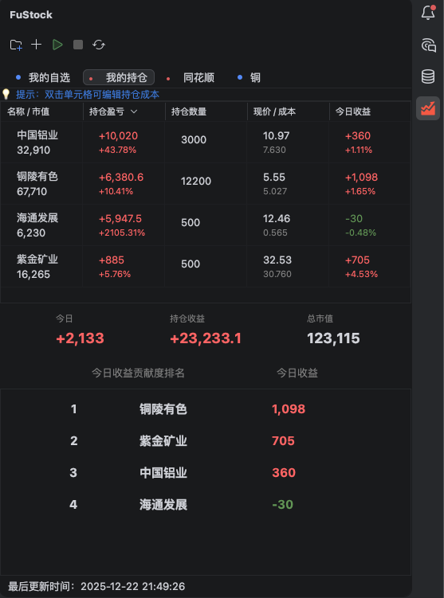
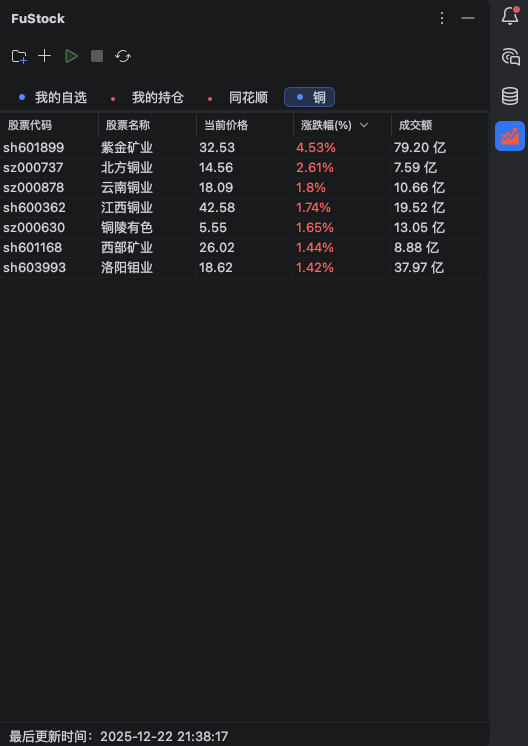
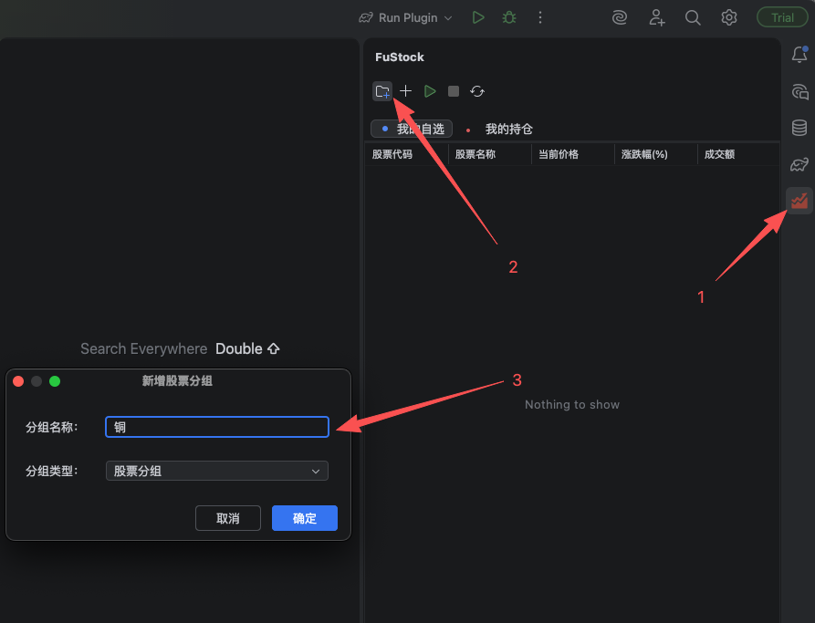
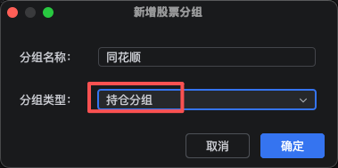
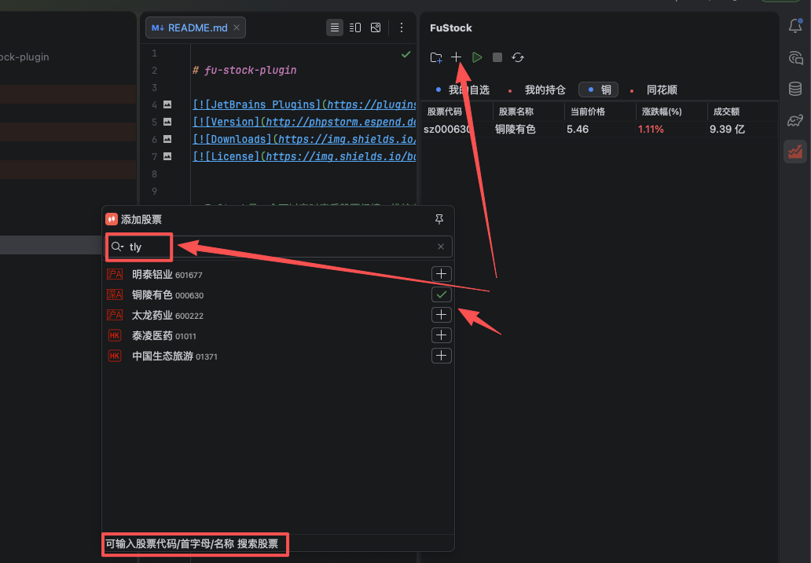

# fu-stock-plugin

> FuStock是一个可以实时查看A股和港股股票行情，维护自己股票持仓的炒股插件。支持多分组管理，实时刷新股票行情，股票每日收益信息等

> FuStock默认3s刷新一次，只有展开侧边栏并且开启自动刷新时才会实时刷新，当隐藏侧边栏时，会默认停止自动刷新，避免大量无效请求

快速开始
----

#### 安装插件

#### 添加股票分组

#### 添加股票

